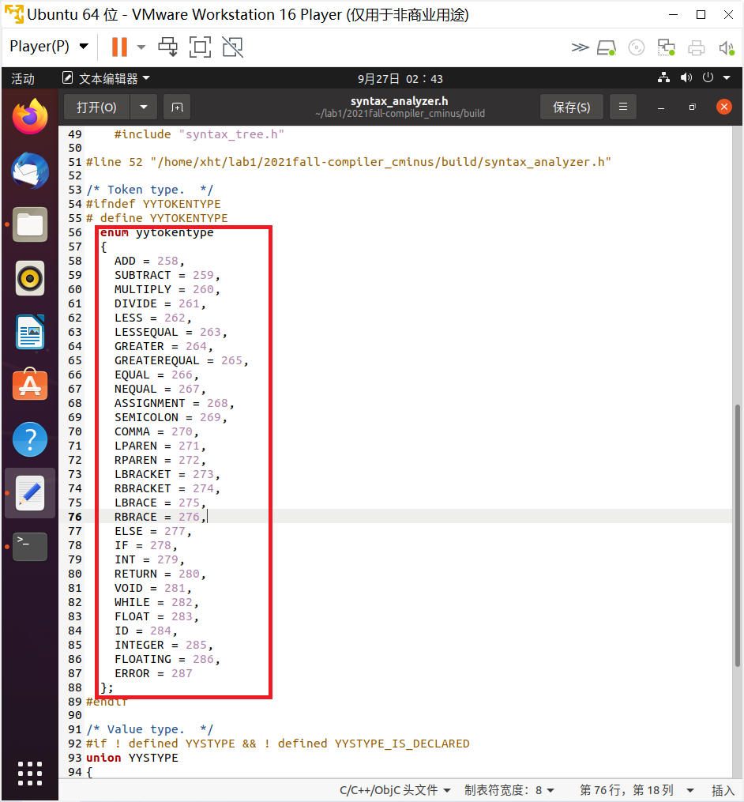
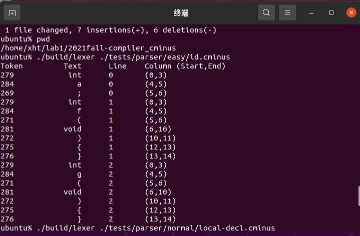
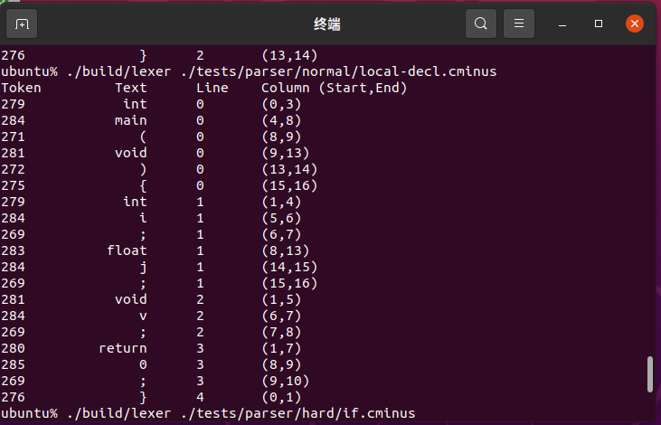
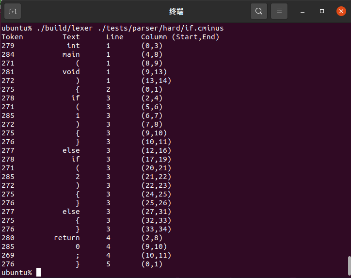
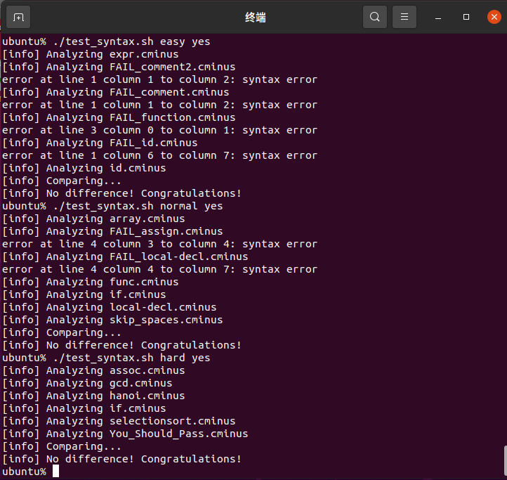

# lab1 实验报告
学号:PB19071535 姓名:徐昊天


## 实验要求
1. 本次实验需要从无到有完成一个完整的 Cminus-f 解析器，包括基于 `flex` 的词法分析器和基于 `bison` 的语法分析器。
2. 第一部分需要根据`Cminus-f`的词法补全`src/parser/lexical_analyzer.l`文件，完成词法分析器。在`lexical_analyzer.l`文件中，需补全模式和动作，能够输出识别出的`token`，`text` ,`line(刚出现的行数)`，`pos_start(该行开始位置)`，`pos_end(结束的位置,不包含)`。
3. 第二部分需要完成 `src/parser/syntax_analyzer.y`。与词法分析器相同，需要根据代码中的提示和基础知识中给出的文法填写相应的规则。


## 实验难点
1. 理解Cminus-f词法中`注释`的正则表达式，使得能够正确地处理Cminus-f中的注释内容。
2. 学习并理解`Flex`与`Bison`的用法，并理解两者如何联动与协同工作。
3. 理解`src/parser/lexical_analyzer.l`与`src/parser/syntax_analyzer.y`文件中的代码意义并了解其原理与作用。


## 实验设计

#### 1.词法分析器部分

根据`src/parser/lexical_analyzer.l`中提供的以下两句示例：

```
\+ 	{pos_start = pos_end; pos_end += 1; pass_node(yytext); return ADD;}
. { pos_start = pos_end; pos_end++; return ERROR; }
```

并结合`实验基础知识`文档中的以下Cminus-f语法：

1. 关键字

   ```c
   else if int return void while float
   ```

2. 专用符号

   ```c
   + - * / < <= > >= == != = ; , ( ) [ ] { } /* */
   ```

3. 标识符ID和整数NUM，通过下列正则表达式定义:

   ```c
   letter = a|...|z|A|...|Z
   digit = 0|...|9
   ID = letter+
   INTEGER = digit+
   FLOAT = (digit+. | digit*.digit+)
   ```

4. 注释用`/*...*/`表示，可以超过一行。注释不能嵌套。

   ```c
   /*...*/
   ```

为其余语法按照示例结构添加对应代码，以下是部分添加的代码：

```
/*专用符号*/
\- {pos_start = pos_end; pos_end += 1; pass_node(yytext); return SUBTRACT;}
\* {pos_start = pos_end; pos_end += 1; pass_node(yytext); return MULTIPLY;}
\/ {pos_start = pos_end; pos_end += 1; pass_node(yytext); return DIVIDE;}

/*关键字*/
else {pos_start = pos_end; pos_end += 4; pass_node(yytext); return ELSE;}
if {pos_start = pos_end; pos_end += 2; pass_node(yytext); return IF;}

/*标识符ID，通过下列正则表达式定义：*/
[a-zA-Z]+ {pos_start = pos_end; pos_end += strlen(yytext); pass_node(yytext); return ID;}

/*正确的注释语法*/
"/*"([^\*]|(\*)*[^\*/])*(\*)*"*/" {
     pos_start = pos_end;
     for (int i = 0; i < strlen(yytext); i++) {
          if(yytext[i] == '\n') {
               pos_start = pos_end = 0;
               lines++;
          }
          else
            pos_end++;
     }
}
```


#### 2.语法分析器部分

在`src/parser/syntax_analyzer.y`中根据`src/parser/lexical_analyzer.l`中定义的语法补全%token <node>部分；根据`实验基础知识`文档提供的Cminus-f语法并结合`src/parser/lexical_analyzer.l`中提供的以下示例:

```
program: declaration-list {$$ = node( "program", 1, $1); gt->root = $$;};
```

为其余语法添加对应代码，以下是部分添加的代码：

```
declaration-list
: declaration-list declaration {$$ = node("declaration-list", 2, $1, $2);}
| declaration {$$ = node("declaration-list", 1, $1);}
;
declaration
: var-declaration {$$ = node("declaration", 1, $1);}
| fun-declaration {$$ = node("declaration", 1, $1);}
;
var-declaration
: type-specifier ID SEMICOLON {$$ = node("var-declaration", 3, $1, $2, $3);}
| type-specifier ID LBRACKET INTEGER RBRACKET SEMICOLON {$$ = node("var-declaration", 6, $1, $2, $3, $4, $5, $6);}
;
```

并为Cminus-f的所有规则补全%type <node>部分。


## 实验结果验证

请提供部分自行设计的测试

#### 1.词法分析器部分

根据实验文档的步骤编译后，`build/syntax_analyzer.h`文件中生成的`token`如下图所示：



运行部分测试数据后结果如下图所示：







对比Cminus-f源代码可知结果正确。


#### 2.语法分析器部分

通过文档中提供的 `test_syntax.sh` 脚本进行快速批量测试，结果如下图所示：



如上图所示，`easy` `normal` `hard`等测试集均通过，结果正确。


## 实验反馈

1. 本次实验初步了解了Bison,Flex的用法，并实践了词法分析和语法分析。为后续实验打下了基础。
2. 本次实验难度中等，需利用代码中的示例重复类似结构，并参考文档提供的提示信息从而提高效率。
3. 本次实验文档略微难懂，需要反复阅读和理解才能开始写代码。

