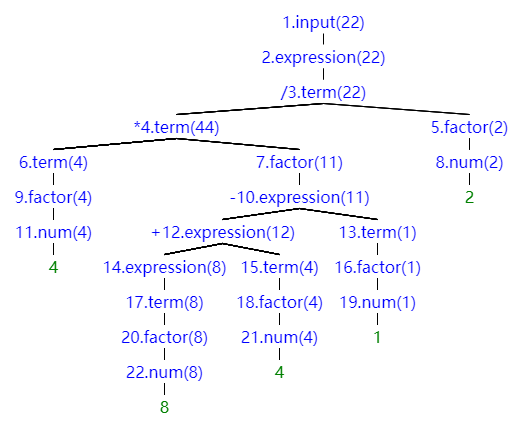

# lab2 实验报告
学号：PB19071535 姓名：徐昊天

## 问题1: cpp 与 .ll 的对应
请说明你的 cpp 代码片段和 .ll 的每个 BasicBlock 的对应关系。

### 1.assign

```c++
    // main函数
    auto mainFun = Function::create(FunctionType::get(Int32Type, {}),
                                    "main", module);
    auto bb = BasicBlock::create(module, "entry", mainFun);
    // BasicBlock的名字在生成中无所谓,但是可以方便阅读
    builder->set_insert_point(bb);

    auto retAlloca = builder->create_alloca(Int32Type);
    builder->create_store(CONST_INT(0), retAlloca);             // 默认 ret 0
    
    // int a[10]
    auto *arrayType = ArrayType::get(Int32Type, 10);
    auto a = builder->create_alloca(arrayType);

    // a[0] = 10
    auto a0GEP = builder->create_gep(a, {CONST_INT(0), CONST_INT(0)});
    builder->create_store(CONST_INT(10), a0GEP);

    // a[1] = a[0] * 2
    auto a1GEP = builder->create_gep(a, {CONST_INT(0), CONST_INT(1)});
    auto a0Load = builder->create_load(a0GEP);
    auto a1 = builder->create_imul(a0Load, CONST_INT(2));
    builder->create_store(a1, a1GEP);

    // return a[1]
    auto a1NGEP = builder->create_gep(a, {CONST_INT(0), CONST_INT(1)});
    auto a1return = builder->create_load(a1NGEP);
    builder->create_ret(a1return);
```

`cpp`文件中仅有`bb = BasicBlock::create(module, "entry", mainFun);`这一基本块，对应.ll文件的代码如下：

```
define i32 @main() {
label_entry:
  %op0 = alloca i32
  store i32 0, i32* %op0
  %op1 = alloca [10 x i32]
  %op2 = getelementptr [10 x i32], [10 x i32]* %op1, i32 0, i32 0
  store i32 10, i32* %op2
  %op3 = getelementptr [10 x i32], [10 x i32]* %op1, i32 0, i32 1
  %op4 = load i32, i32* %op2
  %op5 = mul i32 %op4, 2
  store i32 %op5, i32* %op3
  %op6 = getelementptr [10 x i32], [10 x i32]* %op1, i32 0, i32 1
  %op7 = load i32, i32* %op6
  ret i32 %op7
}

```

即`bb = BasicBlock::create(module, "entry", mainFun);`对应.ll文件`main`中`label_entry`基本块。


### 2.fun

```c++
    // 由函数类型得到函数
    auto calleeFun = Function::create(calleeFunTy,
                                   "callee", module);
    // BB的名字在生成中无所谓,但是可以方便阅读
    auto bb = BasicBlock::create(module, "entry", calleeFun);
  
    builder->set_insert_point(bb); 

    auto retAlloca = builder->create_alloca(Int32Type);   // 在内存中分配返回值的位置
    auto aAlloca = builder->create_alloca(Int32Type);     // 在内存中分配参数a的位置

    std::vector<Value *> args;  // 获取callee函数的形参,通过Function中的iterator
    for (auto arg = calleeFun->arg_begin(); arg != calleeFun->arg_end(); arg++) {
      args.push_back(*arg);   // * 号运算符是从迭代器中取出迭代器当前指向的元素
    }

    builder->create_store(args[0], aAlloca);  // 将参数a store下来
    auto aLoad = builder->create_load(aAlloca);
    auto mul = builder->create_imul(CONST_INT(2), aLoad);
    builder->create_store(mul, retAlloca);  // 将参数a * 2 store下来
    auto retLoad = builder->create_load(retAlloca);
    builder->create_ret(retLoad);  // return 2 * a
```

`cpp`文件中`bb = BasicBlock::create(module, "entry", calleeFun);`基本块对应.ll文件的代码如下：

```
define i32 @callee(i32 %arg0) {
label_entry:
  %op1 = alloca i32
  %op2 = alloca i32
  store i32 %arg0, i32* %op2
  %op3 = load i32, i32* %op2
  %op4 = mul i32 2, %op3
  store i32 %op4, i32* %op1
  %op5 = load i32, i32* %op1
  ret i32 %op5
}
```

即`bb = BasicBlock::create(module, "entry", calleeFun);`对应.ll文件`callee`中`label_entry`基本块。


```c++
   // main函数
    auto mainFun = Function::create(FunctionType::get(Int32Type, {}),
                                    "main", module);
    bb = BasicBlock::create(module, "entry", mainFun);
    // BasicBlock的名字在生成中无所谓,但是可以方便阅读
    builder->set_insert_point(bb);
  
    retAlloca = builder->create_alloca(Int32Type);
    builder->create_store(CONST_INT(0), retAlloca);             // 默认 ret 0
    auto call = builder->create_call(calleeFun, {CONST_INT(110)});

    builder->create_ret(call);  // return callee(110)

```

`cpp`文件中`bb = BasicBlock::create(module, "entry", mainFun);`基本块对应.ll文件的代码如下：

```
define i32 @main() {
label_entry:
  %op0 = alloca i32
  store i32 0, i32* %op0
  %op1 = call i32 @callee(i32 110)
  ret i32 %op1
}

```

即`bb = BasicBlock::create(module, "entry", mainFun);`对应.ll文件`main`中`label_entry`基本块。


### 3.if

```c++
    // main函数
    auto mainFun = Function::create(FunctionType::get(Int32Type, {}),
                                    "main", module);
    auto bb = BasicBlock::create(module, "entry", mainFun);
    // BasicBlock的名字在生成中无所谓,但是可以方便阅读
    builder->set_insert_point(bb);
  
    auto retAlloca = builder->create_alloca(Int32Type);
    builder->create_store(CONST_INT(0), retAlloca);             // 默认 ret 0

    auto aAlloca = builder->create_alloca(FloatType);     // 在内存中分配参数a的位置
    builder->create_store(CONST_FP(5.555), aAlloca);  // 将参数a store下来
    auto aLoad = builder->create_load(aAlloca);  // 将参数a load上来
    auto fcmp = builder->create_fcmp_gt(aLoad, CONST_FP(1.0));  // 比较a和1
    auto trueBB = BasicBlock::create(module, "trueBB", mainFun);  // true分支
    auto falseBB = BasicBlock::create(module, "falseBB", mainFun); // false分支
    auto br = builder->create_cond_br(fcmp, trueBB, falseBB);  // 条件BR
```

`cpp`文件中`bb = BasicBlock::create(module, "entry", mainFun);`基本块对应.ll文件的代码如下：

```
label_entry:
  %op0 = alloca i32
  store i32 0, i32* %op0
  %op1 = alloca float
  store float 0x40163851e0000000, float* %op1
  %op2 = load float, float* %op1
  %op3 = fcmp ugt float %op2,0x3ff0000000000000
  br i1 %op3, label %label_trueBB, label %label_falseBB
```

即`bb = BasicBlock::create(module, "entry", mainFun);`对应.ll文件`main`中`label_entry`基本块。


```c++
    // if true
    builder->set_insert_point(trueBB);
    builder->create_ret(CONST_INT(233));  // return 233
```

`cpp`文件中`bb = BasicBlock::create(module, "trueBB", mainFun);`基本块对应.ll文件的代码如下：

```
label_trueBB:                                                ; preds = %label_entry
  ret i32 233
```

即`bb = BasicBlock::create(module, "trueBB", mainFun);`对应.ll文件`main`中`label_trueBB`基本块。


```c++
    // if false
    builder->set_insert_point(falseBB);
    builder->create_ret(CONST_INT(0));  // return 0

```

`cpp`文件中`bb = BasicBlock::create(module, "falseBB", mainFun);`基本块对应.ll文件的代码如下：

```
label_falseBB:                                                ; preds = %label_entry
  ret i32 0
```

即`bb = BasicBlock::create(module, "falseBB", mainFun);`对应.ll文件`main`中`label_falseBB`基本块。


### 4.while

```c++
    // main函数
    auto mainFun = Function::create(FunctionType::get(Int32Type, {}),
                                    "main", module);
    auto bb = BasicBlock::create(module, "entry", mainFun);
    // BasicBlock的名字在生成中无所谓,但是可以方便阅读
    builder->set_insert_point(bb);
  
    auto retAlloca = builder->create_alloca(Int32Type);
    builder->create_store(CONST_INT(0), retAlloca);             // 默认 ret 0

    auto aAlloca = builder->create_alloca(Int32Type);     // 在内存中分配参数a的位置
    auto iAlloca = builder->create_alloca(Int32Type);     // 在内存中分配参数i的位置 
    builder->create_store(CONST_INT(10), aAlloca);              // 将参数a store下来
    builder->create_store(CONST_INT(0), iAlloca);              // 将参数i store下来
```

`cpp`文件中`bb = BasicBlock::create(module, "entry", mainFun);`基本块对应.ll文件的代码如下：

```
label_entry:
  %op0 = alloca i32
  store i32 0, i32* %op0
  %op1 = alloca i32
  %op2 = alloca i32
  store i32 10, i32* %op1
  store i32 0, i32* %op2
  br label %label_whileBB
```

即`bb = BasicBlock::create(module, "entry", mainFun);`对应.ll文件`main`中`label_entry`基本块。


```c++
    // while(i < 10)
    auto whileBB = BasicBlock::create(module, "whileBB", mainFun);
    builder->create_br(whileBB);
    builder->set_insert_point(whileBB);
    
    auto aLoad = builder->create_load(aAlloca);  // 将参数a load上来
    auto iLoad = builder->create_load(iAlloca);  // 将参数i load上来

    auto icmp = builder->create_icmp_lt(iLoad, CONST_INT(10));  // i和10的比较

    auto trueBB = BasicBlock::create(module, "trueBB", mainFun);    // true分支
    auto falseBB = BasicBlock::create(module, "falseBB", mainFun);  // false分支
    auto br = builder->create_cond_br(icmp, trueBB, falseBB);  // 条件BR
```

`cpp`文件中`bb = BasicBlock::create(module, "whileBB", mainFun);`基本块对应.ll文件的代码如下：

```
label_whileBB:                                                ; preds = %label_entry, %label_trueBB
  %op3 = load i32, i32* %op1
  %op4 = load i32, i32* %op2
  %op5 = icmp slt i32 %op4, 10
  br i1 %op5, label %label_trueBB, label %label_falseBB
```

即`bb = BasicBlock::create(module, "whileBB", mainFun);`对应.ll文件`main`中`label_whileBB`基本块。


```c++
    // if true
    builder->set_insert_point(trueBB);
    iLoad = builder->create_load(iAlloca);
    auto iret = builder->create_iadd(iLoad, CONST_INT(1));  // i = i + 1
    builder->create_store(iret, iAlloca);
    iLoad = builder->create_load(iAlloca);
    aLoad = builder->create_load(aAlloca);
    auto aret = builder->create_iadd(aLoad, iLoad);  // a = a + i
    builder->create_store(aret, aAlloca);
    aLoad = builder->create_load(aAlloca);
    builder->create_br(whileBB);

```

`cpp`文件中`bb = BasicBlock::create(module, "trueBB", mainFun);`基本块对应.ll文件的代码如下：

```
label_trueBB:                                                ; preds = %label_whileBB
  %op6 = load i32, i32* %op2
  %op7 = add i32 %op6, 1
  store i32 %op7, i32* %op2
  %op8 = load i32, i32* %op2
  %op9 = load i32, i32* %op1
  %op10 = add i32 %op9, %op8
  store i32 %op10, i32* %op1
  %op11 = load i32, i32* %op1
  br label %label_whileBB
```

即`bb = BasicBlock::create(module, "trueBB", mainFun);`对应.ll文件`main`中`label_trueBB`基本块。


```c++
    // if false
    builder->set_insert_point(falseBB);
    aLoad = builder->create_load(aAlloca);
    builder->create_ret(aLoad);  // return a
```

`cpp`文件中`bb = BasicBlock::create(module, "falseBB", mainFun);`基本块对应.ll文件的代码如下：

```
label_falseBB:                                                ; preds = %label_whileBB
  %op12 = load i32, i32* %op1
  ret i32 %op12
```

即`bb = BasicBlock::create(module, "falseBB", mainFun);`对应.ll文件`main`中`label_falseBB`基本块。

## 问题2: Visitor Pattern
分析 `calc` 程序在输入为 `4 * (8 + 4 - 1) / 2` 时的行为：
1. 请画出该表达式对应的抽象语法树（使用 `calc_ast.hpp` 中的 `CalcAST*` 类型和在该类型中存储的值来表示），并给节点使用数字编号。
2. 请指出示例代码在用访问者模式遍历该语法树时的遍历顺序。

序列请按如下格式指明（序号为问题 2.1 中的编号）：  
3->2->5->1

1. 抽象语法树如下图所示：
   
   

   如上图所示，`CalcAST*` 类型左侧为数字编号，右侧括号内的数字为该类型存储的值。若节点存在左右子树，其第一位字符表示运算op。

2. 遍历顺序为：

   1->2->3->4->6->9->11->9->6->4->7->10->12->14->17->20->22->20->17->14->12->15->18->21->18->15->12->10->13->16->19->16->13->10->7->4->3->5->8->5->3->2->1

## 问题3: getelementptr
请给出 `IR.md` 中提到的两种 getelementptr 用法的区别,并稍加解释:
  - `%2 = getelementptr [10 x i32], [10 x i32]* %1, i32 0, i32 %0`
  - `%2 = getelementptr i32, i32* %1 i32 %0`

第一句中，`[10 x i32]`表示10位整型数组，`[10 x i32]*`表示指向数组的指针，`%1`为数组指针，`i32 0`表示数组指针的第0位，类型为`[10 x i32]`；`i32 %0`表示`0`位数组中下标为`%0`的元素，类型为`i32`。

第二句中，`i32`表示整型数，`i32*`表示指向整型数的指针，`%1`为整型数指针，`i32 %0`表示`%1`后偏移`%0`位所指向的元素，类型为`i32`。


## 实验难点

1. 理解IR格式、指令与cpp语法需要一定的时间，尤其是C++的类关系较为复杂，理解和运用有一定难度。
2. 实验总体难度适中，根据提供的示例代码参考和理解后，完成实验困难较小。

## 实验反馈
1. 本次实验学习了LLVM IR与LightIR的使用，深入理解了.ll文件的逻辑功能。
2. 实验文档质量较高，内容详实，对实验的进行帮助极大。
